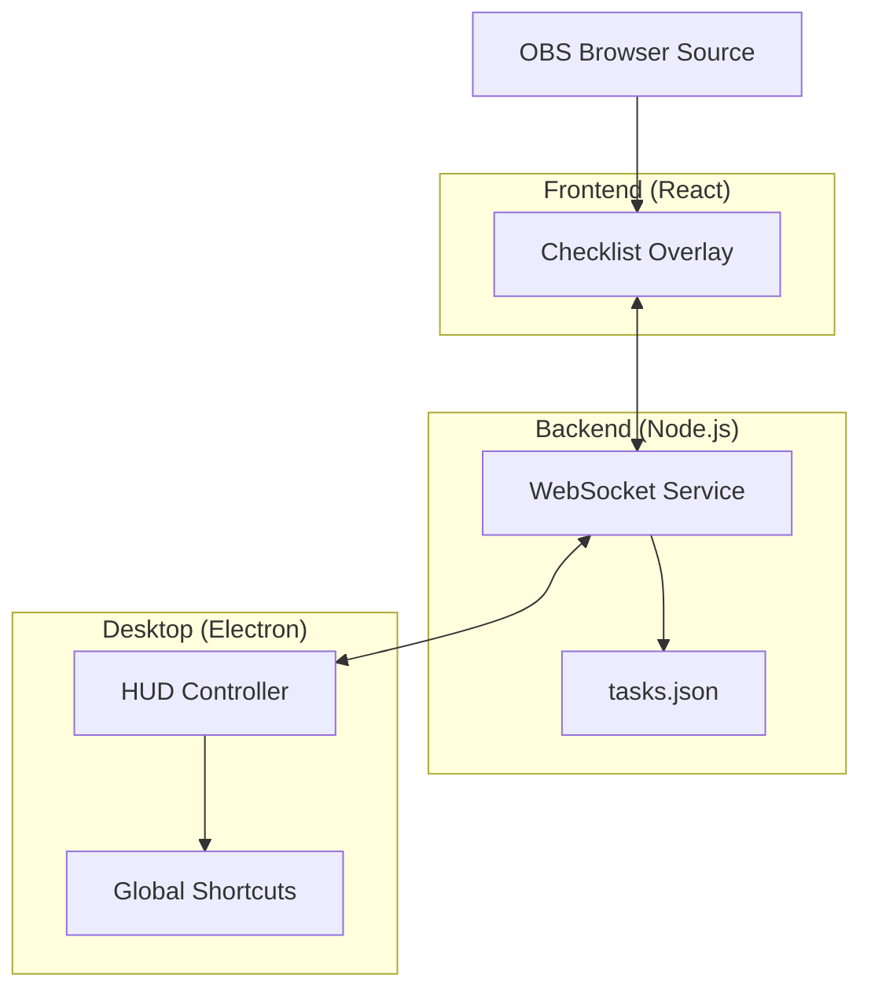

# Stream HUD - Project Structure

A comprehensive browser overlay system for OBS with checklist and progress tracking capabilities.

## 🏗️ Architecture Overview

This is a **monorepo** project using **pnpm workspaces** that consists of three main components:

- **Frontend Overlay** (`apps/checklist-overlay`) - React-based browser source overlay
- **Desktop Controller** (`apps/hud-controller`) - Electron app for global shortcuts
- **WebSocket Service** (`services/checklist-ws`) - Real-time communication backend

## 📁 Project Structure

```
stream-hud/
├── 📦 Root Configuration
│   ├── package.json              # Root package with workspace scripts
│   ├── pnpm-workspace.yaml       # PNPM workspace configuration
│   ├── pnpm-lock.yaml           # Dependency lock file
│   ├── tsconfig.base.json        # Base TypeScript configuration
│   └── .gitignore               # Git ignore rules
│
├── 🎯 Applications (apps/)
│   ├── checklist-overlay/        # Browser overlay for OBS
│   │   ├── src/
│   │   │   ├── App.tsx           # Main React application
│   │   │   ├── main.tsx          # React entry point
│   │   │   ├── styles.css        # Global styles
│   │   │   ├── lib/              # Utility libraries
│   │   │   │   ├── format.ts     # Text formatting utilities
│   │   │   │   ├── params.ts     # URL parameter handling
│   │   │   │   └── ws.ts         # WebSocket client
│   │   │   └── panels/           # UI Components
│   │   │       └── Checklist.tsx # Main checklist component
│   │   ├── index.html            # HTML entry point
│   │   ├── package.json          # React/Vite dependencies
│   │   ├── vite.config.ts        # Vite build configuration
│   │   ├── tailwind.config.ts    # Tailwind CSS configuration
│   │   ├── postcss.config.cjs    # PostCSS configuration
│   │   └── tsconfig.json         # TypeScript configuration
│   │
│   └── hud-controller/           # Desktop controller app
│       ├── src/
│       │   ├── main.ts           # Electron main process
│       │   ├── api.ts            # API communication
│       │   ├── autostart.ts      # Auto-launch functionality
│       │   ├── shortcuts.ts      # Global keyboard shortcuts
│       │   ├── tasks.ts          # Task management logic
│       │   └── tray.ts           # System tray integration
│       ├── package.json          # Electron dependencies
│       ├── electron.vite.config.ts # Electron-Vite configuration
│       ├── tsconfig.json         # TypeScript configuration
│       └── .env.example          # Environment variables template
│
├── 🔧 Services (services/)
│   └── checklist-ws/             # WebSocket backend service
│       ├── src/
│       │   └── server.ts         # WebSocket server implementation
│       ├── package.json          # Node.js dependencies
│       └── tsconfig.json         # TypeScript configuration
│
├── ⚙️ Configuration (configs/)
│   └── tasks.json                # Persistent task storage
│
├── 📚 Documentation (docs/)
│   ├── PROJECT_STRUCTURE.md      # This file - project architecture
│   └── API.md                    # API documentation (to be created)
│
├── 📝 Project Files
│   ├── README.md                 # Main project documentation
│   └── prompt.md                 # Development prompts/notes
│
└── 🚀 Deployment
    └── .vercel/                  # Vercel deployment configuration
        └── project.json
```

## 🔄 Component Interactions



## 🛠️ Technology Stack

### Frontend Overlay (`checklist-overlay`)
- **Framework**: React 18 with TypeScript
- **Build Tool**: Vite
- **Styling**: Tailwind CSS + PostCSS
- **Animations**: Framer Motion
- **Communication**: WebSocket client

### Desktop Controller (`hud-controller`)
- **Framework**: Electron 27
- **Build Tool**: Electron-Vite
- **Language**: TypeScript
- **Features**: Global shortcuts, system tray, auto-launch
- **Communication**: WebSocket client + HTTP API

### WebSocket Service (`checklist-ws`)
- **Runtime**: Node.js with TypeScript
- **Framework**: Express.js
- **WebSocket**: ws library
- **File Watching**: Chokidar
- **CORS**: Enabled for cross-origin requests

## 📋 Development Scripts

### Root Level Commands
```bash
# Development (overlay + websocket)
pnpm dev

# Development (all components)
pnpm dev:all

# Individual component development
pnpm dev:overlay    # Start overlay dev server
pnpm dev:ws         # Start WebSocket service
pnpm dev:controller # Start Electron controller

# Production builds
pnpm build          # Build all components
pnpm build:overlay  # Build overlay only
pnpm build:ws       # Build WebSocket service
pnpm build:controller # Build Electron app
```

## 🔧 Configuration Files

- **`pnpm-workspace.yaml`**: Defines workspace packages
- **`tsconfig.base.json`**: Shared TypeScript configuration
- **`configs/tasks.json`**: Persistent task data storage
- **Individual `package.json`**: Component-specific dependencies
- **Individual `tsconfig.json`**: Component-specific TS configs

## 🚀 Deployment

- **Overlay**: Can be deployed to Vercel or any static hosting
- **WebSocket Service**: Node.js server deployment
- **Controller**: Electron app packaging for desktop platforms

## 📝 Data Flow

1. **Task Management**: Tasks stored in `configs/tasks.json`
2. **Real-time Updates**: WebSocket service broadcasts changes
3. **Global Controls**: Electron controller sends commands via WebSocket
4. **Visual Display**: React overlay receives updates and renders UI
5. **OBS Integration**: Browser source displays the overlay

## 🔍 Key Features

- ✅ Real-time checklist synchronization
- ⌨️ Global keyboard shortcuts
- 🎨 Customizable overlay appearance
- 💾 Persistent task storage
- 🔄 Auto-launch desktop controller
- 🖥️ System tray integration
- 📱 Cross-platform compatibility

## 📁 Folder Organization Principles

- **`apps/`**: User-facing applications (frontend, desktop)
- **`services/`**: Backend services and APIs
- **`configs/`**: Configuration and data files
- **`docs/`**: Project documentation
- **Root level**: Project-wide configuration and main README

---

*This structure supports a scalable, maintainable streaming overlay system with real-time capabilities and desktop integration.*